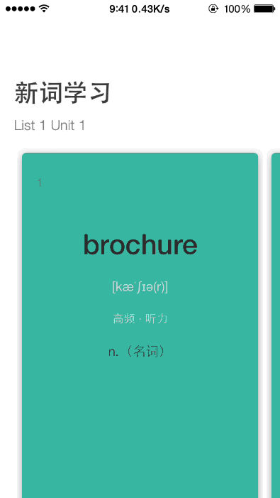

## 说明

### 需求：

初始左边有空白，滚动剧中，两边要显示上下item


### 效果演示：




### 关键代码：

```objc
- (CGPoint)targetContentOffsetForProposedContentOffset:(CGPoint)offset
                                 withScrollingVelocity:(CGPoint)velocity {

    CGRect cvBounds = self.collectionView.bounds;
    CGFloat halfWidth = cvBounds.size.width * 0.5f;
    CGFloat proposedContentOffsetCenterX = offset.x + halfWidth;

    NSArray* attributesArray = [self layoutAttributesForElementsInRect:cvBounds];

    UICollectionViewLayoutAttributes* candidateAttributes;
    for (UICollectionViewLayoutAttributes* attributes in attributesArray) {

        // == Skip comparison with non-cell items (headers and footers) == //
        if (attributes.representedElementCategory !=
            UICollectionElementCategoryCell) {
            continue;
        }

        // == First time in the loop == //
        if(!candidateAttributes) {
            candidateAttributes = attributes;
            continue;
        }

        if (fabs(attributes.center.x - proposedContentOffsetCenterX) <
            fabs(candidateAttributes.center.x - proposedContentOffsetCenterX)) {
            candidateAttributes = attributes;
        }
    }

    return CGPointMake(candidateAttributes.center.x - halfWidth, offset.y);

}
```

### 参考链接：

http://stackoverflow.com/questions/20496850/uicollectionview-with-paging-setting-page-width?noredirect=1&lq=1
